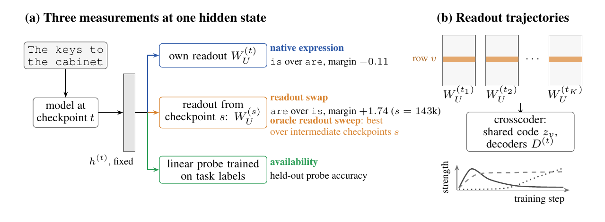

# Learning to Read Out: Unembedding Dynamics in Language Model Pretraining

[](#citation)
[](https://huggingface.co/hematteo)
[](LICENSE)
[](https://github.com/hematteo/learning-to-read-out/actions/workflows/ci.yml)

This repository is the official implementation of **Learning to Read Out:
Unembedding Dynamics in Language Model Pretraining** (NeurIPS 2026), by Matteo
He, William F. Shen, Alex Iacob, Andrej Jovanovic, Xinchi Qiu, and Nicholas D.
Lane.

<p align="center">
  
</p>

Whether a model predicts the right token depends on two learned components: the
final hidden state and the unembedding matrix `W_U` (the *readout*) that maps it to
logits. We find that several task distinctions become **available**, decodable by
a linear probe from the hidden state, before the model's own readout **natively
expresses** them. To separate the two components we introduce
**parameter-trajectory crosscoding**, which fits one sparse dictionary to the
trajectory every vocabulary row of `W_U` traces across checkpoints. We combine it
with readout swaps (decoding one checkpoint's hidden state with another
checkpoint's readout) and probes on fixed hidden states, on Pythia (160M to 6.9B)
and OLMo-2-7B, and in controlled 31M pretraining runs that vary only the readout's
learning rate.

## Contents

- [Requirements](#requirements)
- [Quickstart](#quickstart)
- [Pretrained dictionaries and checkpoints](#pretrained-dictionaries-and-checkpoints)
- [Training](#training)
- [Evaluation: reproducing the paper](#evaluation-reproducing-the-paper)
- [Results](#results)
- [Using the library](#using-the-library)
- [Repository layout](#repository-layout)
- [Citation](#citation)
- [License](#license)

## Requirements

- Python 3.11 or 3.12, with the environment managed by [`uv`](https://docs.astral.sh/uv/).
- The test suite, examples, and notebooks run CPU-only on Linux, macOS, or Windows
  (all three are tested in CI).
- Training crosscoders on models above 160M, and the 31M pretraining runs, target
  Linux with CUDA 11.8 (torch is pinned to the cu118 wheels on Linux; other
  platforms install torch from PyPI). Device selection is automatic
  (CUDA > MPS > CPU).

```bash
git clone https://github.com/hematteo/learning-to-read-out.git
cd learning-to-read-out
make install   # uv sync --extra dev; also builds the vendored SAE library in lib/
```

Checkpoints, snapshots, and outputs are stored under `UM_SSD_ROOT`
(default `./local_snapshots`); see [`docs/DATA.md`](docs/DATA.md) for the layout and
disk requirements.

## Quickstart

```bash
make test                                    # full test suite, CPU-only, no data needed
uv run python examples/minimal_crosscoder.py # fit a trajectory crosscoder on a synthetic W_U stack
```

The test suite fetches one small tokenizer (Pythia-160M) on the first networked run
and skips those tests offline. Two Colab-ready notebooks walk through the core
analyses on public Pythia checkpoints, with no release artifacts needed:

| Notebook | What it shows |
|---|---|
| [`01_availability_expression_lag.ipynb`](notebooks/01_availability_expression_lag.ipynb) | [](https://colab.research.google.com/github/hematteo/learning-to-read-out/blob/main/notebooks/01_availability_expression_lag.ipynb) The availability–expression lag via readout swaps |
| [`02_wu_trajectory_crosscoders.ipynb`](notebooks/02_wu_trajectory_crosscoders.ipynb) | [](https://colab.research.google.com/github/hematteo/learning-to-read-out/blob/main/notebooks/02_wu_trajectory_crosscoders.ipynb) Trajectory crosscoders from a toy to real `W_U` snapshots, lifecycles, and vocabulary families |

## Pretrained dictionaries and checkpoints

Everything trained for the paper is on Hugging Face:

| Repository | Contents |
|---|---|
| [`hematteo/parameter-trajectory-crosscoders`](https://huggingface.co/hematteo/parameter-trajectory-crosscoders) | Trained trajectory crosscoders (Pythia-160M, 1B, 6.9B; OLMo-2-7B) with training sidecars, aggregates, activation rates, attribution artifacts, and held-out eval tokens |
| [`hematteo/readout-recipe-control`](https://huggingface.co/hematteo/readout-recipe-control) | The controlled 31M pretraining runs (readout learning rate 0.25×, 1×, 4×; short and long warmup) |
| [`datasets/hematteo/wu-crosscoder-snapshots`](https://huggingface.co/datasets/hematteo/wu-crosscoder-snapshots) | Pre-extracted `W_U` snapshot stacks |

To skip retraining, download the dictionaries at the pinned release revision:

```bash
hf download hematteo/parameter-trajectory-crosscoders \
    --revision fb7ee860b9257f125ddbac7ff3c793b35fdcce8d \
    --local-dir "$UM_SSD_ROOT/hf_release/parameter-trajectory-crosscoders"
```

## Training

**Trajectory crosscoders.** `W_U` snapshots are extracted from the public Hugging
Face checkpoints automatically on a cache miss, so training needs only a model name.
For example, the Pythia-160M dictionary used in the paper:

```bash
uv run python scripts/train/train_crosscoder.py \
    --model EleutherAI/pythia-160m --expansion-factor 32.0 \
    --batch-size 1024 --lr 5e-5 --n-epochs 300 --seed 0 \
    --input-preprocess center_scale --amp-dtype fp32 --tanh-stretch 1.0 \
    --output local_snapshots/wu_cc_pythia160m_seed0.pt
```

The settings of record for every dictionary in the paper are in
[`configs/runs/`](configs/runs/):

| Config | Model | Matrix | Width |
|---|---|---|---|
| `pythia-160m_wu_d24576_seed0.yaml` | Pythia-160M | `W_U` | 24,576 |
| `pythia-1b_wu_d24576_seed0.yaml` | Pythia-1B | `W_U` | 24,576 |
| `pythia-6.9b_wu_d32768_seed0_{sparse,dense}.yaml` | Pythia-6.9B | `W_U` | 32,768 |
| `olmo-2-7b_wu_d32768_seed0.yaml` | OLMo-2-7B | `W_U` | 32,768 |
| `pythia-160m_we_d8192_seed0.yaml` | Pythia-160M | `W_E` | 8,192 |

**Controlled pretraining runs.** The 31M runs with a scaled readout learning
rate are trained by
[`experiments/ablations/pretraining_recipe_control/`](experiments/ablations/pretraining_recipe_control/),
for example:

```bash
uv run python experiments/ablations/pretraining_recipe_control/scripts/train_control.py \
    --data $UM_SSD_ROOT/pile_slice/pile_neox20b.bin --out-dir $UM_SSD_ROOT/runs/baseline \
    --model-size 31M --global-batch 1024 --max-tokens 10e9 \
    --readout-lr-mult 1.0 --warmup-steps 1430
```

That experiment's README gives the data preparation and the other three conditions.

## Evaluation: reproducing the paper

This is a code-only release. The scripts compute and save the metrics behind each
figure and table (CSV, JSON, or `.pt`, under the gitignored `results/` tree). No
data or metric files ship with the repository, and figures are rendered in the
paper's LaTeX tree.

To reproduce a specific figure, find its label in [`docs/REPRODUCE.md`](docs/REPRODUCE.md),
which links it to the experiment and the script that produces its metrics. Each
experiment's README lists its commands in order. The main-text results map as
follows:

| Paper | Experiment |
|---|---|
| Figure 1 (overview margins), Table 1 | [`experiments/probes/contrastive_readout_swap/`](experiments/probes/contrastive_readout_swap/) |
| Figure 2 (feature lifecycles), reorganization window | [`experiments/lifecycle/feature_lifecycle_trajectories/`](experiments/lifecycle/feature_lifecycle_trajectories/), with dictionaries from [`experiments/crosscoders/`](experiments/crosscoders/) |
| Figure 3 (WordNet categories in the readout) | [`experiments/probes/concept_evolution_validation/`](experiments/probes/concept_evolution_validation/) |
| Figure 4 (availability before expression) | [`experiments/probes/contrastive_readout_swap/`](experiments/probes/contrastive_readout_swap/) |
| Section 4.4 (sparse feature ablation) | [`experiments/causal/contrastive_task_feature_rescue/`](experiments/causal/contrastive_task_feature_rescue/) |
| Figure 5 (readout learning rate) | [`experiments/ablations/pretraining_recipe_control/`](experiments/ablations/pretraining_recipe_control/) |

The pipeline stages are `make extract`, `make train`, and `make analyze`
(`make help` prints each one's commands), and `make audit` checks that every
experiment, manifest entry ([`experiments.yaml`](experiments.yaml)), and figure
label line up.

## Results

Headline findings; see the paper for the full analysis and controls.

| Finding | Result |
|---|---|
| The dictionaries are faithful | Explained variance 0.808–0.920 across Pythia-160M, 1B, 6.9B and OLMo-2-7B; 1.17–2.26% of features active per row and checkpoint; no dead features |
| The readout reorganizes early | The reorganization score peaks between steps 512 and 1.6k in all three Pythia models (0.4–1.1% of training); p = 0.005 at 160M and 1B, p = 0.04 at 6.9B against circular-shift nulls; 20 of 21 dictionary fits select the same window |
| Lexical structure forms in that window | Pythia-160M readout rows separate all 35 WordNet categories by step 1000 (median balanced accuracy 0.499 → 0.874), beyond matched-random and shuffled-label controls |
| Availability precedes native expression | On Pythia-6.9B subject–verb agreement, a probe nears ceiling by step 512 while native expression is at chance; across a subject relative clause, native accuracy is still 0.75 at the end of training while the probe stays at ceiling |
| A few features carry task margins | Ablating 8 selected features drops Pythia-1B SVA accuracy from 0.900 to 0.487 (matched controls stay ≥ 0.900); greater-than drops from 0.512 to 0.084 |
| Readout learning rate sets the timing | In 31M runs, each 4× increase in the readout learning rate halves the median feature peak step (128 → 64 → 32, in every fit); final validation losses agree within 0.06 nats |

## Using the library

The trajectory-crosscoder and probe code is an installable package, `readout`:

```python
from readout.crosscoder import build_crosscoder, train, quick_quality
from readout.core.data import center_and_project
```

[`examples/minimal_crosscoder.py`](examples/minimal_crosscoder.py) is a small,
seeded, CPU-only example of the full fit.

## Repository layout

| Path | Contents |
|---|---|
| `src/readout/` | The `readout` package: `core/` (paths, model specs, data), `crosscoder/` (trajectory training), `dynamics/` (lifecycle metrics), `probes/`, `baselines/` |
| `experiments/` | One directory per experiment, grouped by theme, each with a README and its scripts; [`experiments.yaml`](experiments.yaml) maps them to paper figures |
| `scripts/` | Shared command-line entry points: `extract/`, `train/`, `eval/`, `audit/` |
| `configs/` | Settings of record for each published dictionary, and the preregistration |
| `notebooks/`, `examples/` | Guided tours and minimal examples |
| `tests/` | CPU-only pytest suite |
| `docs/` | [`REPRODUCE.md`](docs/REPRODUCE.md), [`DATA.md`](docs/DATA.md), [`THIRD_PARTY.md`](docs/THIRD_PARTY.md) |
| `lib/` | Vendored OpenMOSS [Language-Model-SAEs](https://github.com/OpenMOSS/Language-Model-SAEs); see [`docs/THIRD_PARTY.md`](docs/THIRD_PARTY.md) |

Module and file names use a few abbreviations: `wu`/`we` for `W_U`/`W_E`, `hln` for
the post-final-LayerNorm hidden state, `sva` for subject–verb agreement, `persnap`
for the per-snapshot SAE baseline, `cc` for crosscoder, `ev` for explained
variance, and `l0` for active features per row. [`CONTRIBUTING.md`](CONTRIBUTING.md)
describes the layout rules that `make audit` enforces in CI.

A companion repository,
[`sparse-readout-prism`](https://github.com/hematteo/sparse-readout-prism)
([arXiv:2609.01936](https://arxiv.org/abs/2609.01936)), factorizes a model's final
`W_U` into a sparse feature basis for logit-lens analysis; the readout prism
appendix of this paper previews that work.

## Citation

```bibtex
@inproceedings{he2026learningtoreadout,
  title     = {Learning to Read Out: Unembedding Dynamics in Language Model Pretraining},
  author    = {He, Matteo and Shen, William F. and Iacob, Alex and Jovanovic, Andrej
               and Qiu, Xinchi and Lane, Nicholas D.},
  booktitle = {Advances in Neural Information Processing Systems},
  year      = {2026},
}
```

Machine-readable metadata is in [`CITATION.cff`](CITATION.cff).

## License

MIT; see [`LICENSE`](LICENSE). The vendored library under `lib/` is also MIT
(© 2024 OpenMOSS); see [`docs/THIRD_PARTY.md`](docs/THIRD_PARTY.md).
